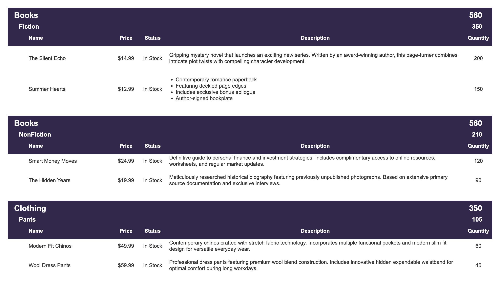

## Reporting

### HTable

The HTable is used to generate hierarchical tables like this:

#### Example HTable Output:



#### Example HTable Code:

```typescript
const builder = new OdinHTableConfigBuilder();

// Configure columns
builder
  .getColumnsConfig()
  .addColumn(
    new ColumnBuilder("Name", 1)
      .setAlignment("left")
      .setContentAlignment("left")
  )
  .addColumn(new ColumnBuilder("Price", 2).setAlignment("center"))
  .addColumn(new ColumnBuilder("Status", 3))
  .addColumn(new ColumnBuilder("Description", 4).setContentAlignment("left"))
  .addColumn(new ColumnBuilder("Quantity", 5));

// Create hierarchy
const books = builder.createHierarchyNode("books", "Books", "560");
const fiction = books.createChild("fiction", "Fiction", "350");
const nonfiction = books.createChild("nonfiction", "NonFiction", "210");

// Add rows to Fiction category
builder.addRows(fiction, [
  {
    Name: "The Silent Echo",
    Price: "$14.99",
    Status: "In Stock",
    Description: "Gripping mystery novel that launches an exciting new series.",
    Quantity: "200",
  },
  {
    Name: "Summer Hearts",
    Price: "$12.99",
    Status: "In Stock",
    Description: "Contemporary romance paperback with exclusive bonus content.",
    Quantity: "150",
  },
]);

// Add rows to NonFiction category
builder.addRows(nonfiction, [
  {
    Name: "Smart Money Moves",
    Price: "$24.99",
    Status: "In Stock",
    Description:
      "Definitive guide to personal finance and investment strategies.",
    Quantity: "120",
  },
]);

return builder.build(); // returns the HTML string
```
